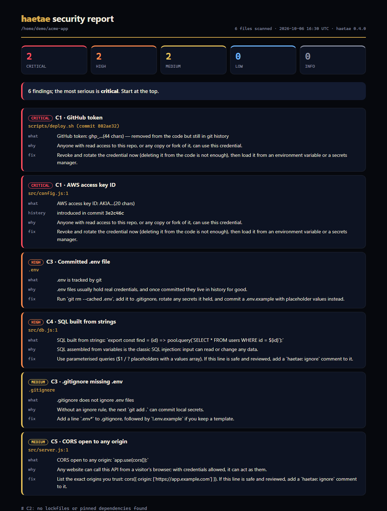

# haetae (해태)

[](https://github.com/jankykohh-boop/haetae-scanner/actions/workflows/ci.yml)


[](LICENSE)

**A security checklist for your repository.** Point it at a repo and get a ranked list of security problems, each with where it is, why it matters, and how to fix it.

In Korean folklore, the haetae is a guardian that protects against disaster; statues of it stand watch at Gyeongbokgung Palace in Seoul. This one stands watch before you ship.

```
$ haetae . --history

haetae 0.5.0 · scanned 42 files in /home/me/my-app

 CRITICAL  C1 AWS access key ID — config.js:12
    AWS access key ID: AKIA…(20 chars)
    introduced in commit 3f9c2ab
    why: Anyone with read access to this repo, or any copy or fork of it, can use this credential.
    fix: Revoke and rotate the credential now (deleting it from the code is not enough), then load it from an environment variable or a secrets manager.

 HIGH  C3 Committed .env file — .env
    .env is tracked by git
    why: .env files usually hold real credentials, and once committed they live in history for good.
    fix: Run `git rm --cached .env`, add it to .gitignore, rotate any secrets it held, and commit a .env.example with placeholder values instead.

Summary: 1 critical, 1 high
```

Secrets are **always redacted** in every output format. haetae never prints what it finds in full.

**Want something to share?** `haetae --format html -o report.html` writes a single, self-contained report page: severity summary cards you can click to filter, every finding with its fix, and automatic light/dark mode. It loads nothing from the internet, so it works offline and is safe to attach to a ticket.



<sub>Demo repo with planted fake credentials; regenerate with `python scripts/make_demo.py`.</sub>

## Install

Requires Python 3.10+. No third-party dependencies.

```bash
git clone https://github.com/jankykohh-boop/haetae-scanner.git
cd haetae-scanner
pip install .
```

Or run it without installing: `python -m haetae <path>` from the repo folder.

## Usage

```bash
haetae                      # scan the current directory
haetae path/to/repo         # scan another repo
haetae --history            # also check every commit for secrets that were deleted but never rotated
haetae --format json        # machine-readable output for CI and other tools
haetae --format md          # Markdown report to attach to a ticket or pull request
haetae --format html -o report.html   # a standalone report page to open in a browser or share
haetae --format sarif -o haetae.sarif # SARIF for GitHub code scanning
haetae --baseline haetae-baseline.json   # fail only on findings not accepted earlier
haetae --fail-on critical   # only fail on critical findings (default: high)
haetae --offline            # never touch the network (skips the dependency check)
haetae --exclude "fixtures" # skip paths; repeatable
haetae --include-ignored    # also scan files git ignores (skipped by default)
```

To always skip some paths, list globs in a `.haetaeignore` file at the repo root (same idea as `.gitignore`).

**Exit codes:** `0` clean (nothing at or above `--fail-on`), `1` findings, `2` error.

## Checks

**Privacy:** the dependency check sends only package names and versions to osv.dev. Your code and file contents never leave your machine, and `--offline` turns the network off entirely.


| ID | Check | Status |
|---|---|---|
| C1 | **Secrets** in files and git history: private keys, AWS, GitHub, Stripe, Slack, Google, OpenAI and Anthropic keys, database URLs with passwords, JWTs, hardcoded passwords | ✅ v0.1 |
| C3 | **Committed `.env` and key files**, and `.gitignore` gaps | ✅ v0.1 |
| C2 | **Dependency vulnerabilities** from `package-lock.json`, `package.json`, `requirements*.txt`, `Pipfile.lock`, `poetry.lock`, Maven `pom.xml` and `gradle.lockfile`, checked against [OSV](https://osv.dev). One finding per package, ranked by the worst advisory, dev-only dependencies one step lower, with the smallest safe upgrade | ✅ v0.2, Java v0.5 |
| C4 | **Dangerous code patterns.** JS/TS/HTML and Python: `eval` / `new Function` / `exec`, shell commands and SQL built from variables, unsafe deserialization. **Shell and Dockerfiles:** `curl … \| bash`, `eval "$var"`. **Java:** `Runtime.exec` with variables, `sh -c` via ProcessBuilder, SQL built from strings, `readObject`, weak crypto (DES/ECB, MD5/SHA-1). Parameterised SQL with dynamic column names is reported separately, as medium | ✅ v0.5 |
| C5 | **Insecure defaults.** Debug mode, CORS open to any origin, TLS verification off (`verify=False`, `curl -k`, trust-all managers), well-known default passwords, world-writable `chmod 777`. **Terraform:** public S3 buckets and disabled public-access blocks, public databases, encryption off, IAM `Allow` on every action, IMDSv1, and security groups open to the internet, judged by direction and port (SSH, RDP and databases are high; egress and 80/443 are fine). **Spring:** all Actuator endpoints exposed, H2 console on | ✅ v0.5 |
| C6 | **Repo hygiene** (always low): no `SECURITY.md`, `package.json` without a lockfile, nothing scanning dependencies in CI | ✅ v0.3 |

When a check can't run (not a git repo, offline), the report says so. It also names any language in the repo that the code-pattern checks don't cover yet (Go, Ruby, PHP, C#…), so a clean report is never read as more than it is. haetae never reports "clean" for something it didn't check.

**What it leaves out, and says so:** files git ignores (they aren't committed, so nothing in them has leaked through the repo; `--include-ignored` scans them), and other repositories or git worktrees nested inside the one you scan (scan each on its own). Guesses from a variable name (`password = "…"`) in test files are reported as **low**, since they are almost always fixtures; recognised provider keys (AWS, GitHub, Stripe, Anthropic…) keep their full severity everywhere. Form-field words such as `autocomplete="new-password"` or a `'Password'` label, and obvious `mock-` or `stub-` values, are not reported.

**Silencing a reviewed line:** add a `haetae: ignore` comment to it (`eval(trusted) // haetae: ignore, reviewed 2026-10-06`). Every check skips that line, so an accepted exception doesn't fail CI forever, and the reason sits next to the code. Code-pattern rules also skip comment lines, text inside string literals (an error message that mentions `eval`), minified lines, and rank anything in test files as low.

The full product spec, including acceptance criteria and milestones, is in [SPEC.md](SPEC.md).

## Use it in CI (GitHub Action)

```yaml
# .github/workflows/security.yml
name: security
on:
  push:
  pull_request:
  schedule:
    - cron: "17 13 * * 1"   # weekly: new advisories land against unchanged code
permissions:
  contents: read
jobs:
  haetae:
    runs-on: ubuntu-latest
    steps:
      - uses: actions/checkout@v4
        with:
          fetch-depth: 0          # full history, for the secrets-in-history check
      - uses: jankykohh-boop/haetae-scanner@v0.5.0
```

The report appears in the run's summary, and the step fails on anything at or above `fail-on`.

| Input | Default | What it does |
|---|---|---|
| `path` | `.` | Directory to scan |
| `history` | `true` | Also scan every commit for secrets |
| `fail-on` | `high` | Fail on findings at or above this severity |
| `offline` | `false` | Skip the dependency check instead of contacting osv.dev |
| `baseline` | | Baseline file; only new findings fail |
| `sarif-file` | | Also write SARIF, for GitHub code scanning |

Outputs: `exit-code` (0 / 1 / 2) and `report` (path of the Markdown report).

**Findings in GitHub's Security tab:** write SARIF and upload it.

```yaml
    permissions:
      contents: read
      security-events: write
    steps:
      - uses: actions/checkout@v4
        with:
          fetch-depth: 0
      - id: haetae
        uses: jankykohh-boop/haetae-scanner@v0.5.0
        with:
          sarif-file: haetae.sarif
        continue-on-error: true
      - uses: github/codeql-action/upload-sarif@v3
        with:
          sarif_file: haetae.sarif
```

Code scanning is free on public repositories; private ones need GitHub Advanced Security.

haetae runs its own action on itself in [its CI](.github/workflows/ci.yml).

## Adopting it on an existing repo: baselines

An older codebase usually has findings you can't fix today. Accept them once and fail only on new ones:

```bash
haetae . --history --write-baseline haetae-baseline.json   # accept today's findings
git add haetae-baseline.json                                # review it like code
haetae . --history --baseline haetae-baseline.json         # only new findings fail
```

The baseline holds one-way ids plus the check, rule, file and severity, so it's readable in a pull request and never contains a secret or code. Ids come from *what* was found (the secret's hash, the flagged line, the package and version), not line numbers, so findings stay accepted when code around them moves. When something in the baseline is fixed, the report says so; re-run `--write-baseline` to drop it.

## Development

```bash
python -m unittest -v
```

Tests build throwaway git repos with planted (fake) secrets and check that each acceptance criterion in the spec holds, including that no raw secret ever appears in any output format.

## Security

Found a problem in haetae itself? See [SECURITY.md](SECURITY.md).

## License

[MIT](LICENSE) © 2026 Joshua Lee
